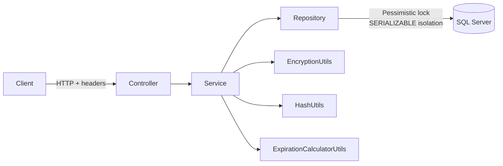
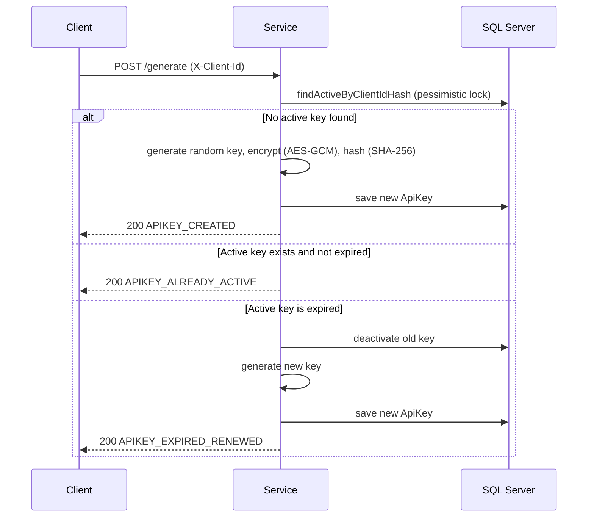
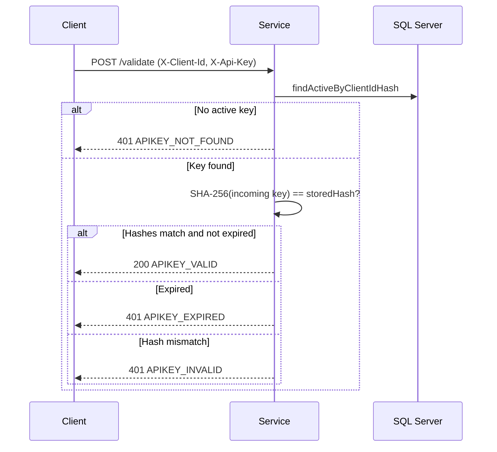
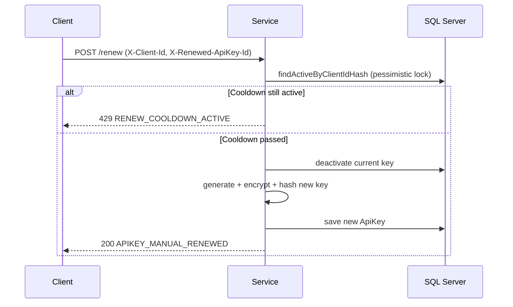

# API Key Service


REST microservice for managing the full lifecycle of API Keys: generation, validation, and renewal with AES-GCM encryption, SHA-256 hashing, and strict transactional control.

---

## Documentation

| Resource | Description |
|----------|-------------|
| [User Stories (Confluence)](https://joaquinasr16.atlassian.net/wiki/spaces/PORT/pages/458753/Historias+de+Usuario+-+API+Key+Service) | HU-01 through HU-06 — actors, acceptance criteria and response codes for each operation |
| [Flow diagrams (diagrams.net)](https://app.diagrams.net/#Uhttps://raw.githubusercontent.com/Joaquin-asr/apikey-service/main/docs/diagrams/api-flows.drawio) | Detailed flowcharts for all three endpoints, every decision branch and error path included |

---

## The problem it solves

When multiple clients or services need to authenticate against an API, someone has to handle key issuance, rotation, and revocation securely. The common issues:

- Keys hardcoded in config files or shared over Slack.
- No expiration — compromised keys stay valid indefinitely.
- Race conditions when two processes request a key at the same time.
- No audit trail to know who had access and when.

This service solves all of that in one place.

---

## Business value

| Benefit | How this service delivers it |
|---------|------------------------------|
| Centralized key management | Single endpoint for all key operations — no scattered logic across services |
| Automatic expiration | Keys expire on a configurable day of the week, enforcing periodic rotation without manual work |
| Compliance-friendly audit trail | Every key (active or expired) is stored — you know who had access and for how long |
| Prevents accidental mass revocation | Cooldown period between manual renewals stops a bad actor (or a bug) from cycling keys repeatedly |
| Zero plaintext storage | AES-GCM encryption means the database never holds a readable key |

---

## Functional requirements

| ID | Requirement |
|----|-------------|
| RF-01 | Exactly one active API key per client at any given time |
| RF-02 | Keys expire on a configurable day of the week |
| RF-03 | Manual renewal must respect a configurable cooldown period |
| RF-04 | Key validation must not expose or decrypt the stored value |
| RF-05 | Concurrent generation requests must never produce duplicate active keys |

---

## Architecture



---

## How each operation works

For a complete step-by-step breakdown of each endpoint — all validation branches, locking behavior, and error paths — open the [draw.io flowcharts](https://app.diagrams.net/#Uhttps://raw.githubusercontent.com/Joaquin-asr/apikey-service/main/docs/diagrams/api-flows.drawio) (3 pages, one per endpoint). The sequence diagrams below show the happy path.

### Generate (`POST /api/apikeys/generate`)



### Validate (`POST /api/apikeys/validate`)



### Renew (`POST /api/apikeys/renew`)



---

## Technical decisions

**AES-GCM over AES-CBC**  
GCM provides authenticated encryption — it detects tampering without a separate HMAC. Each key is encrypted with a fresh random IV, so identical keys produce different ciphertext in the database.

**Pessimistic locking + SERIALIZABLE isolation**  
`generate` and `renew` acquire a database-level lock before reading. Under high concurrency (validated with k6 stress tests), this prevents the race condition where two simultaneous requests each see "no active key" and both insert one, violating RF-01.

**SHA-256 for validation, never decrypt**  
The stored hash is compared against `SHA-256(incomingKey)`. The encrypted value is only needed if a client requests their own key back — validation never touches it. This limits the blast radius of a database breach.

---

## Stack

| Layer | Technology |
|-------|-----------|
| Framework | Spring Boot 3.3 |
| Language | Java 21 (virtual threads enabled) |
| Database | Microsoft SQL Server |
| ORM | Spring Data JPA / Hibernate |
| Security | AES-GCM + SHA-256 |
| Concurrency | Pessimistic locking + SERIALIZABLE isolation |
| Logging | SLF4J + Logback (rolling files, 30-day retention) |
| Request tracing | MDC Correlation IDs (`X-Correlation-Id` header) |
| Schema migrations | Liquibase |
| Observability | Spring Boot Actuator |
| API docs | SpringDoc / Swagger UI |
| Load testing | k6 |

---

## Running locally

### Option 1 — Docker Compose (recommended)

No manual database setup required.

```bash
docker compose up --build
```

The compose file starts SQL Server, creates the database, and then starts the service. Everything is wired automatically.

### Option 2 — Maven

**Prerequisites:** Java 21+, Maven 3.8+, SQL Server on `localhost:1433`

```sql
-- Create the database first
CREATE DATABASE apikeys;
```

```bash
mvn spring-boot:run
```

### Environment variables

All have defaults for local development — no configuration needed to run.

| Variable | Default | Description |
|----------|---------|-------------|
| `VALID_CLIENT_ID` | `CLIENT-001` | Accepted client identifier |
| `RENEWED_APIKEY_ID` | `RENEW-SECRET-KEY-001` | Secret required to trigger manual renewal |
| `ENCRYPTION_KEY` | `A1B2C3D4E5F60708` | AES key (must be exactly 16 characters) |
| `EXPIRATION_DAY` | `MONDAY` | Day of the week when keys expire |
| `RENEW_COOLDOWN_HOURS` | `24` | Hours that must pass between manual renewals |

---

## API reference

Base URL: `http://localhost:8080/api/apikeys`  
Interactive docs: `http://localhost:8080/swagger-ui.html`

| Method | Path | Required headers | Description |
|--------|------|-----------------|-------------|
| `POST` | `/generate` | `X-Client-Id` | Returns the active key, or generates a new one if none exists or it expired |
| `POST` | `/validate` | `X-Client-Id`, `X-Api-Key` | Checks if the provided key is active and valid |
| `POST` | `/renew` | `X-Client-Id`, `X-Renewed-ApiKey-Id` | Manually rotates the key (subject to cooldown) |

### Response format

```json
{
  "success": true,
  "apiKey": "abc123...",
  "message": "New API key generated successfully",
  "code": "APIKEY_CREATED"
}
```

### Response codes

| Code | HTTP | When |
|------|------|------|
| `APIKEY_CREATED` | 200 | New key generated |
| `APIKEY_ALREADY_ACTIVE` | 200 | Active key already existed |
| `APIKEY_EXPIRED_RENEWED` | 200 | Key was expired, auto-renewed |
| `APIKEY_MANUAL_RENEWED` | 200 | Manual renewal successful |
| `APIKEY_VALID` | 200 | Key is valid |
| `RENEW_COOLDOWN_ACTIVE` | 429 | Cooldown period not yet elapsed |
| `INVALID_CLIENT_ID` | 401 | Unrecognized client ID |
| `INVALID_RENEWED_APIKEY_ID` | 401 | Wrong renewal secret |
| `MISSING_PARAMETERS` | 401 | Required header missing |
| `APIKEY_NOT_FOUND` | 401 | No active key for this client |
| `APIKEY_EXPIRED` | 401 | Key has expired |
| `APIKEY_INVALID` | 401 | Key does not match stored hash |

---

## Observability

Every HTTP request is automatically assigned a `X-Correlation-Id` UUID. If the client includes this header, the service reuses it; otherwise it generates one. The ID appears on every log line for that request — across business logic, aspects, and database calls — and is returned in the response header, enabling end-to-end tracing across services.

```
2026-05-08 21:32:10.445 INFO  c.e.a.aspect.LoggingAspect [a3f2b1c4-8e7d-4f6a-9b2c] - [createOrGetApiKey] Start
2026-05-08 21:32:10.451 INFO  c.e.a.aspect.LoggingAspect [a3f2b1c4-8e7d-4f6a-9b2c] - [createOrGetApiKey] End (6ms)
```

| Endpoint | What it shows |
|----------|--------------|
| `/actuator/health` | App status and database connectivity |
| `/actuator/info` | Service metadata |
| `/actuator/metrics` | JVM, HTTP, and connection pool metrics |

---

## Tests

```bash
# Unit tests
mvn test

# Stress tests — requires k6 installed and the service running
k6 run tests/k6/generate_stress.js
k6 run tests/k6/validate_stress.js
k6 run tests/k6/renew_stress.js
```
